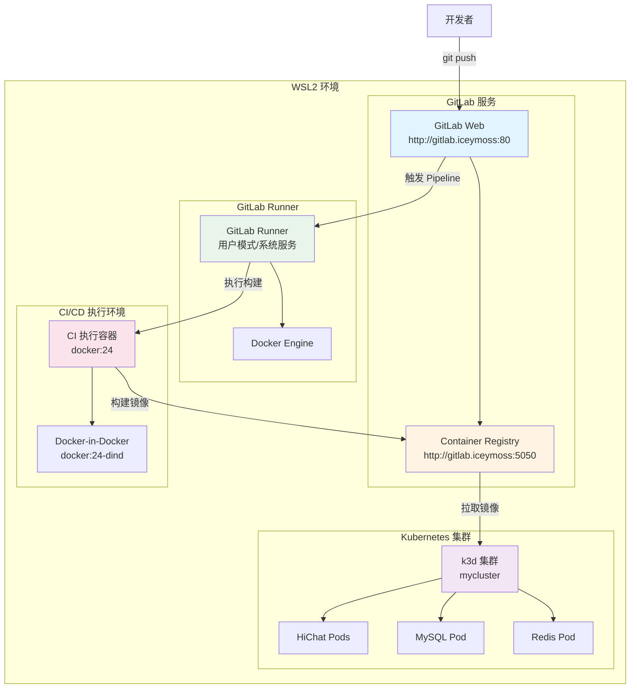
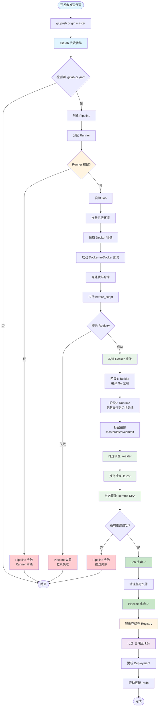

# GitLab CI/CD 完整搭建指南

本文档详细记录从 GitLab 安装、Runner 配置到成功实现 CI/CD 的完整过程，包括所有遇到的问题和解决方案。

**文档版本**: 1.0  
**最后更新**: 2025-11-17  
**环境**: WSL2 (Windows Subsystem for Linux)

---

## 目录

1. [环境准备](#环境准备)
2. [系统架构](#系统架构)
3. [GitLab 安装与配置](#gitlab-安装与配置)
4. [项目推送到 GitLab](#项目推送到-gitlab)
5. [GitLab Runner 安装与注册](#gitlab-runner-安装与注册)
6. [启用 Container Registry](#启用-container-registry)
7. [CI/CD 配置](#cicd-配置)
8. [CI/CD 流程图](#cicd-流程图)
9. [问题排查与解决方案](#问题排查与解决方案)
10. [验证与使用](#验证与使用)

---

## 环境准备

### 系统要求

- **操作系统**: WSL2 或 Linux
- **内存**: 至少 4GB（推荐 8GB）
- **磁盘空间**: 至少 10GB
- **CPU**: 2 核以上

### 前置软件

确保已安装：
- Docker
- Git
- curl

---

## 系统架构

### 整体架构图



### 组件说明

- **GitLab Web**: Git 代码仓库和 CI/CD 管理界面
- **Container Registry**: Docker 镜像存储仓库
- **GitLab Runner**: CI/CD 任务执行器
- **Docker-in-Docker**: 在容器中运行 Docker 构建
- **k3d 集群**: 本地 Kubernetes 测试集群

### 数据流向

1. **代码推送**: 开发者 → GitLab Web
2. **触发构建**: GitLab Web → GitLab Runner
3. **执行构建**: Runner → Docker-in-Docker → 构建镜像
4. **推送镜像**: 构建完成 → Container Registry
5. **部署应用**: Registry → k3d 集群 → 应用 Pods

---

## GitLab 安装与配置

### 1. 安装依赖

```bash
# 更新系统
sudo apt-get update

# 安装必要的依赖
sudo apt-get install -y curl openssh-server ca-certificates tzdata perl postfix
```

**注意**: 安装 postfix 时如果提示配置，选择 "No configuration"（如果不需要邮件功能）

### 2. 安装 GitLab CE

```bash
# 下载并安装 GitLab 安装脚本
curl -sS https://packages.gitlab.com/install/repositories/gitlab/gitlab-ce/script.deb.sh | sudo bash

# 安装 GitLab CE（设置外部访问地址）
sudo EXTERNAL_URL="http://gitlab.iceymoss" apt-get install gitlab-ce
```

**说明**:
- `EXTERNAL_URL`: GitLab 访问地址，可以改为你的域名
- 安装过程可能需要 5-10 分钟

### 3. 配置 GitLab

```bash
# 编辑 GitLab 配置文件
sudo nano /etc/gitlab/gitlab.rb
```

**基本配置**:
```ruby
# 外部访问地址
external_url 'http://gitlab.iceymoss'
```

**资源优化配置**（如果内存较小，可选）:
```ruby
# 减少资源使用
puma['worker_processes'] = 2
sidekiq['max_concurrency'] = 5
prometheus_monitoring['enable'] = false
```

**应用配置**:
```bash
sudo gitlab-ctl reconfigure
```

这个过程可能需要几分钟。

### 4. 获取初始 root 密码

```bash
# 查看初始 root 密码
sudo cat /etc/gitlab/initial_root_password
```

**重要**: 记录这个密码，首次登录需要使用

### 5. 配置 hosts 文件

**WSL hosts**:
```bash
echo "127.0.0.1 gitlab.iceymoss" | sudo tee -a /etc/hosts
```

**Windows hosts**（如果需要在浏览器访问）:
1. 以管理员身份打开记事本
2. 打开：`C:\Windows\System32\drivers\etc\hosts`
3. 添加：`127.0.0.1 gitlab.iceymoss`
4. 保存

### 6. 访问 GitLab

1. 打开浏览器访问：`http://gitlab.iceymoss`
2. 使用用户名 `root` 和步骤 4 获取的密码登录
3. 首次登录会要求修改密码

### 7. 验证 GitLab 运行状态

```bash
# 检查 GitLab 服务状态
sudo gitlab-ctl status

# 应该看到所有服务都是 "run"
```

---

## 项目推送到 GitLab

### 1. 在 GitLab 创建项目

1. 登录 GitLab
2. 点击右上角 "+" > "New project"
3. 选择 "Create blank project"
4. 填写项目信息：
   - **Project name**: hichat
   - **Visibility**: Private（或根据需要选择）
5. 点击 "Create project"

### 2. 推送本地项目到 GitLab

```bash
# 进入项目目录
cd /path/to/HiChat

# 添加 GitLab 远程仓库
git remote add origin http://gitlab.iceymoss/root/hichat.git

# 或者如果已有远程仓库，更新 URL
git remote set-url origin http://gitlab.iceymoss/root/hichat.git

# 推送代码
git push -u origin master
```

**如果遇到认证问题**:
```bash
# 使用用户名和密码（或 Personal Access Token）
git remote set-url origin http://root@gitlab.iceymoss/root/hichat.git
```

---

## GitLab Runner 安装与注册

### 1. 安装 GitLab Runner

```bash
# 添加 GitLab Runner 仓库
curl -L "https://packages.gitlab.com/install/repositories/runner/gitlab-runner/script.deb.sh" | sudo bash

# 安装 GitLab Runner
sudo apt-get install gitlab-runner
```

### 2. 获取 Runner 注册 Token

1. 在 GitLab 项目页面，进入 **Settings > CI/CD**
2. 展开 **Runners** 部分
3. 在 **Project runners** 区域，点击 **Create project runner**
4. 配置 Runner（可选）:
   - **Tags**: docker（用于标识 Runner）
   - **Run untagged jobs**: 勾选（允许运行没有标签的作业）
5. 复制显示的注册命令和 token

**示例 token 格式**:
```
glrt-8-zyP48S6l6hzdOO_FvbRW86MQpwOjEKdDozCnU6MQ8.01.170dsyc3c
```

### 3. 注册 Runner

```bash
# 注册 Runner（使用从 GitLab 获取的 token）
gitlab-runner register --url http://gitlab.iceymoss --token <YOUR_TOKEN>
```

**交互式配置**:

1. **GitLab instance URL**: 
   ```
   http://gitlab.iceymoss
   ```
   （直接按 Enter，使用默认值）

2. **Runner name**: 
   ```
   local-runner
   ```
   （或自定义名称）

3. **Executor**: 
   ```
   docker
   ```
   （选择 Docker executor）

4. **Default Docker image**: 
   ```
   docker:24
   ```
   （用于执行 CI/CD 任务的默认镜像）

### 4. 配置 Runner（重要）

编辑 Runner 配置文件：

```bash
# 编辑用户模式配置（如果使用用户模式）
nano ~/.gitlab-runner/config.toml

# 或编辑系统服务配置（如果使用系统服务）
sudo nano /etc/gitlab-runner/config.toml
```

**关键配置**:
```toml
[[runners]]
  name = "local-runner"
  url = "http://gitlab.iceymoss"
  token = "YOUR_TOKEN"
  executor = "docker"
  [runners.cache]
    MaxUploadedArchiveSize = 0
  [runners.docker]
    tls_verify = false
    image = "docker:24"
    privileged = true  # 重要：启用特权模式，支持 Docker-in-Docker
    disable_entrypoint_overwrite = false
    oom_kill_disable = false
    disable_cache = false
    volumes = ["/cache"]
    shm_size = 0
    network_mtu = 0
    # 重要：添加 DNS 解析，让容器能访问本地 GitLab
    extra_hosts = ["gitlab.iceymoss:host-gateway"]
```

**配置说明**:
- `privileged = true`: 启用特权模式，允许在容器中运行 Docker
- `extra_hosts = ["gitlab.iceymoss:host-gateway"]`: 让容器内能解析 `gitlab.iceymoss` 域名

### 5. 启动 Runner

**用户模式**（推荐用于测试）:
```bash
# 后台启动
nohup gitlab-runner run > ~/gitlab-runner.log 2>&1 &

# 查看日志
tail -f ~/gitlab-runner.log
```

我们可以复制一份到：/etc/gitlab-runner/config.toml，然后可以使用系统启动
**系统服务模式**（推荐用于生产）:
```bash
# 如果使用系统服务模式注册
sudo gitlab-runner start

# 检查状态
sudo gitlab-runner status
```

### 6. 验证 Runner 状态

1. 在 GitLab 项目页面，进入 **Settings > CI/CD > Runners**
2. 在 **Project runners** 部分，应该看到 Runner 显示为 **Online**（绿色圆点）

---

## 启用 Container Registry

### 1. 配置 Registry

编辑 GitLab 配置文件：

```bash
sudo nano /etc/gitlab/gitlab.rb
```

**添加或取消注释以下配置**:
```ruby
# 启用 Registry
registry['enable'] = true

# 设置 Registry 外部 URL（使用 HTTP，因为本地环境）
registry_external_url 'http://gitlab.iceymoss:5050'

# 确保 Rails 启用 Registry
gitlab_rails['registry_enabled'] = true
```

**快速配置方法**（追加到文件末尾）:
```bash
sudo bash -c "cat >> /etc/gitlab/gitlab.rb << 'EOF'

# Container Registry 配置（手动添加）
registry['enable'] = true
registry_external_url 'http://gitlab.iceymoss:5050'
gitlab_rails['registry_enabled'] = true
EOF"
```

### 2. 应用配置

```bash
# 重新配置 GitLab
sudo gitlab-ctl reconfigure

# 重启 GitLab（如果需要）
sudo gitlab-ctl restart
```

### 3. 验证 Registry

```bash
# 检查 Registry 服务状态
sudo gitlab-ctl status | grep registry

# 应该看到：run: registry: (pid xxxxx) xs

# 测试 Registry 访问
curl -I http://gitlab.iceymoss:5050/v2/

# 应该返回：HTTP/1.1 401 Unauthorized（这是正常的，表示 Registry 已启用）
```

---

## CI/CD 配置

### 1. 创建 `.gitlab-ci.yml`

在项目根目录创建 `.gitlab-ci.yml` 文件：

```yaml
stages:
  - build

variables:
  DOCKER_DRIVER: overlay2
  DOCKER_TLS_CERTDIR: ""
  # 本地 GitLab Registry 地址（包含端口）
  CI_REGISTRY: "gitlab.iceymoss:5050"
  CI_REGISTRY_IMAGE: "gitlab.iceymoss:5050/root/hichat"
  # 镜像标签：使用分支名和 commit SHA
  IMAGE_TAG: $CI_REGISTRY_IMAGE:$CI_COMMIT_REF_SLUG
  IMAGE_TAG_LATEST: $CI_REGISTRY_IMAGE:latest
  IMAGE_TAG_COMMIT: $CI_REGISTRY_IMAGE:$CI_COMMIT_SHORT_SHA

# 构建并推送 Docker 镜像
build:
  stage: build
  image: docker:24
  services:
    - name: docker:24-dind
      command: ["--insecure-registry=gitlab.iceymoss:5050"]
  before_script:
    # 使用 GitLab CI Token 登录 Registry
    - |
      echo "登录 GitLab Container Registry: $CI_REGISTRY"
      if [ -n "$CI_REGISTRY_USER" ] && [ -n "$CI_REGISTRY_PASSWORD" ]; then
        echo "使用 GitLab 自动提供的认证信息登录"
        docker login -u $CI_REGISTRY_USER -p $CI_REGISTRY_PASSWORD $CI_REGISTRY
      else
        echo "使用 GitLab CI Token 登录"
        docker login -u gitlab-ci-token -p $CI_JOB_TOKEN $CI_REGISTRY
      fi
  script:
    - echo "构建 Docker 镜像..."
    - docker build -t $IMAGE_TAG -t $IMAGE_TAG_LATEST -t $IMAGE_TAG_COMMIT .
    - echo "推送镜像到 GitLab Container Registry..."
    - docker push $IMAGE_TAG
    - docker push $IMAGE_TAG_LATEST
    - docker push $IMAGE_TAG_COMMIT
    - echo "镜像构建完成:"
    - echo "  - $IMAGE_TAG"
    - echo "  - $IMAGE_TAG_LATEST"
    - echo "  - $IMAGE_TAG_COMMIT"
  only:
    - main
    - master
    - develop
    - merge_requests
  tags:
    - docker
```

### 2. 配置说明

**关键配置项**:

1. **CI_REGISTRY**: 本地 GitLab Registry 地址（包含端口 5050）
2. **DOCKER_TLS_CERTDIR**: 设置为空字符串，因为使用 HTTP 而非 HTTPS
3. **services**: 使用 `docker:24-dind` 提供 Docker-in-Docker 功能
4. **command**: 添加 `--insecure-registry` 参数，允许访问 HTTP Registry
5. **before_script**: 自动登录 Registry（优先使用 GitLab 提供的变量）

### 3. 推送配置

```bash
# 添加 CI/CD 配置文件
git add .gitlab-ci.yml
git commit -m "Add GitLab CI/CD configuration"
git push origin master
```

---

## CI/CD 流程图

### 完整 CI/CD 流程



### 流程阶段说明

#### 1. 触发阶段
- **开发者推送代码** → GitLab 检测到代码变更
- **创建 Pipeline** → 根据 `.gitlab-ci.yml` 创建 CI/CD 任务

#### 2. 执行准备阶段
- **分配 Runner** → GitLab 选择可用的 Runner
- **准备环境** → 拉取 Docker 镜像，启动容器
- **启动服务** → 启动 Docker-in-Docker 服务

#### 3. 构建阶段
- **克隆代码** → 从 GitLab 仓库获取最新代码
- **登录 Registry** → 使用 CI Token 登录 Container Registry
- **构建镜像** → 执行多阶段 Docker 构建
  - Builder 阶段：编译 Go 应用
  - Runtime 阶段：准备运行环境

#### 4. 推送阶段
- **标记镜像** → 为镜像打上三个标签
  - 分支标签（如 `master`）
  - 最新标签（`latest`）
  - Commit 标签（commit SHA）
- **推送镜像** → 依次推送到 Container Registry

#### 5. 部署阶段（可选）
- **拉取镜像** → 从 Registry 拉取新镜像
- **更新 Deployment** → 更新 Kubernetes Deployment
- **滚动更新** → 滚动更新应用 Pods

### 关键检查点

1. **Runner 状态检查**: 确保 Runner 在线且可用
2. **Registry 登录**: 验证认证信息正确
3. **镜像构建**: 确保 Dockerfile 正确，依赖完整
4. **镜像推送**: 验证网络连接和权限

### 失败处理

- **Runner 离线**: 检查 Runner 进程，重启 Runner
- **登录失败**: 检查 Registry 配置和认证信息
- **构建失败**: 检查 Dockerfile 和构建日志
- **推送失败**: 检查网络连接和 Registry 状态

---

## 问题排查与解决方案

### 问题 1: YAML 语法错误 - `privileged` 未知键

**错误信息**:
```
jobs:build:services:service config contains unknown keys: privileged
```

**原因**: `.gitlab-ci.yml` 中的 `services` 部分不支持直接设置 `privileged`。`privileged` 只能在 Runner 配置文件中设置。

**解决方案**:
- 从 `.gitlab-ci.yml` 中移除 `privileged: true`
- 确保在 Runner 配置文件（`~/.gitlab-runner/config.toml` 或 `/etc/gitlab-runner/config.toml`）中设置 `privileged = true`

**正确配置**:
```yaml
services:
  - docker:24-dind  # 不要在这里设置 privileged
```

### 问题 2: Docker 登录失败 - 无法解析主机

**错误信息**:
```
Get "https://gitlab.iceymoss/v2/": dial tcp 172.17.0.1:443: connect: connection refused
```

**原因**: 
1. GitLab Container Registry 未启用
2. 容器内无法解析 `gitlab.iceymoss` 域名
3. Registry 地址配置错误

**解决方案**:

1. **启用 Container Registry**（见 [启用 Container Registry](#启用-container-registry) 章节）

2. **配置 Runner DNS 解析**:
   ```toml
   [runners.docker]
     extra_hosts = ["gitlab.iceymoss:host-gateway"]
   ```

3. **使用正确的 Registry 地址**:
   ```yaml
   CI_REGISTRY: "gitlab.iceymoss:5050"  # 包含端口
   ```

### 问题 3: Docker-in-Docker 权限问题

**错误信息**:
```
mount: permission denied (are you root?)
ip: can't find device 'nf_tables'
```

**原因**: Docker-in-Docker 需要特权模式。

**解决方案**:
在 Runner 配置文件中启用特权模式：
```toml
[runners.docker]
  privileged = true
```

### 问题 4: Registry 使用 HTTPS 但配置为 HTTP

**错误信息**:
```
Get "https://gitlab.iceymoss:5050/v2/": dial tcp: lookup gitlab.iceymoss:5050: no such host
```

**原因**: Docker 默认尝试使用 HTTPS 连接 Registry。

**解决方案**:

1. **配置 dind 服务使用 insecure-registry**:
   ```yaml
   services:
     - name: docker:24-dind
       command: ["--insecure-registry=gitlab.iceymoss:5050"]
   ```

2. **禁用 TLS**:
   ```yaml
   variables:
     DOCKER_TLS_CERTDIR: ""  # 空字符串禁用 TLS
   ```

### 问题 5: Runner 注册失败 - Token 无效

**错误信息**:
```
ERROR: Registering runner... forbidden (check registration token) 403 Forbidden - invalid token supplied
```

**原因**: 
- Token 已过期
- Token 复制错误
- Token 不属于当前项目

**解决方案**:
1. 在 GitLab 项目页面重新获取 token：**Settings > CI/CD > Runners > Create project runner**
2. 确保复制完整的 token（包括所有字符）
3. 重新注册 Runner

### 问题 6: Runner 显示 Offline

**原因**: Runner 进程未运行。

**解决方案**:

**检查 Runner 进程**:
```bash
ps aux | grep gitlab-runner | grep -v grep
```

**启动 Runner**:

用户模式:
```bash
nohup gitlab-runner run > ~/gitlab-runner.log 2>&1 &
```

系统服务模式:
```bash
sudo gitlab-runner start
sudo systemctl start gitlab-runner
```

### 问题 7: 两个 Runner 进程冲突

**现象**: 同时存在用户模式和系统服务模式的 Runner。

**解决方案**:

1. **停止用户模式 Runner**:
   ```bash
   pkill gitlab-runner
   ```

2. **选择一种模式**:
   - **测试环境**: 使用用户模式（简单）
   - **生产环境**: 使用系统服务模式（稳定）

3. **统一配置**:
   - 如果使用系统服务，确保配置在 `/etc/gitlab-runner/config.toml`
   - 如果使用用户模式，确保配置在 `~/.gitlab-runner/config.toml`

---

## 验证与使用

### 1. 验证 CI/CD 流程

1. **推送代码触发 Pipeline**:
   ```bash
   git add .
   git commit -m "Test CI/CD"
   git push origin master
   ```

2. **查看 Pipeline 状态**:
   - 在 GitLab 项目页面，点击 **CI/CD > Pipelines**
   - 应该看到 Pipeline 正在运行或已完成

3. **查看构建日志**:
   - 点击 Pipeline，查看每个 Job 的执行日志
   - 确认镜像构建和推送成功

### 2. 查看构建的镜像

1. 在 GitLab 项目页面，点击 **Packages & Registries > Container Registry**
2. 应该看到三个标签的镜像：
   - `gitlab.iceymoss:5050/root/hichat:master`
   - `gitlab.iceymoss:5050/root/hichat:latest`
   - `gitlab.iceymoss:5050/root/hichat:<commit-sha>`

### 3. 使用构建的镜像

**从 Registry 拉取镜像**:
```bash
# 登录 GitLab Registry
docker login gitlab.iceymoss:5050
# 用户名：root
# 密码：你的 GitLab 密码

# 拉取镜像
docker pull gitlab.iceymoss:5050/root/hichat:latest
```

**导入到 k3d 集群**:
```bash
# 导入镜像到 k3d 集群
k3d image import gitlab.iceymoss:5050/root/hichat:latest -c mycluster
```

**更新 Kubernetes Deployment**:
```bash
# 更新 Deployment 使用新镜像
kubectl set image deployment/hichat hichat=gitlab.iceymoss:5050/root/hichat:latest -n hichat

# 验证更新
kubectl get pods -n hichat -w
```

---

## 完整流程总结

### 成功标志

✅ **GitLab 安装成功**:
- 可以访问 `http://gitlab.iceymoss`
- 所有服务状态为 "run"

✅ **Runner 配置成功**:
- Runner 在 GitLab 网页显示为 "Online"
- 可以接收和执行 CI/CD 任务

✅ **Container Registry 启用成功**:
- Registry 服务运行中
- 可以访问 `http://gitlab.iceymoss:5050/v2/`

✅ **CI/CD 流程成功**:
- Pipeline 可以创建和执行
- Docker 镜像构建成功
- 镜像成功推送到 Registry
- 可以在 Registry 页面看到构建的镜像

### 典型 CI/CD 流程

1. **开发者推送代码** → GitLab 仓库
2. **GitLab 触发 Pipeline** → 创建 CI/CD 任务
3. **Runner 接收任务** → 启动 Docker 容器
4. **执行构建脚本**:
   - 登录 Container Registry
   - 构建 Docker 镜像（多阶段构建）
   - 标记镜像（分支名、latest、commit SHA）
   - 推送镜像到 Registry
5. **Pipeline 完成** → 镜像可用于部署

### 镜像标签策略

- **分支标签**: `gitlab.iceymoss:5050/root/hichat:master` - 对应分支的最新镜像
- **Latest 标签**: `gitlab.iceymoss:5050/root/hichat:latest` - 最新构建的镜像
- **Commit 标签**: `gitlab.iceymoss:5050/root/hichat:93f37ea0` - 特定 commit 的镜像

---

## 常用命令参考

### GitLab 管理

```bash
# 启动 GitLab
sudo gitlab-ctl start

# 停止 GitLab
sudo gitlab-ctl stop

# 重启 GitLab
sudo gitlab-ctl restart

# 查看 GitLab 状态
sudo gitlab-ctl status

# 查看 GitLab 日志
sudo gitlab-ctl tail

# 重新配置 GitLab
sudo gitlab-ctl reconfigure
```

### Runner 管理

```bash
# 查看 Runner 状态（用户模式）
ps aux | grep gitlab-runner

# 启动 Runner（用户模式）
nohup gitlab-runner run > ~/gitlab-runner.log 2>&1 &

# 停止 Runner（用户模式）
pkill gitlab-runner

# 查看 Runner 日志
tail -f ~/gitlab-runner.log

# 系统服务模式
sudo gitlab-runner start
sudo gitlab-runner stop
sudo gitlab-runner status
sudo gitlab-runner restart
```

### Docker Registry

```bash
# 登录 Registry
docker login gitlab.iceymoss:5050

# 拉取镜像
docker pull gitlab.iceymoss:5050/root/hichat:latest

# 查看本地镜像
docker images | grep gitlab.iceymoss

# 导入到 k3d
k3d image import gitlab.iceymoss:5050/root/hichat:latest -c mycluster
```

---

## 下一步：集成 ArgoCD

配置好 CI/CD 后，可以：

1. **ArgoCD 从 GitLab Registry 拉取镜像**
2. **ArgoCD 监控 Git 仓库变化**
3. **自动同步部署到 Kubernetes 集群**

实现完整的 GitOps 工作流。

---

## 附录

### A. 配置文件位置

- **GitLab 配置**: `/etc/gitlab/gitlab.rb`
- **Runner 配置（用户模式）**: `~/.gitlab-runner/config.toml`
- **Runner 配置（系统服务）**: `/etc/gitlab-runner/config.toml`
- **CI/CD 配置**: `.gitlab-ci.yml`（项目根目录）

### B. 重要端口

- **GitLab Web**: 80 (HTTP)
- **GitLab Registry**: 5050 (HTTP)
- **GitLab SSH**: 22

### C. 默认账户

- **用户名**: root
- **初始密码**: `/etc/gitlab/initial_root_password`

---

**文档维护**: 如有问题或更新，请及时更新本文档。

